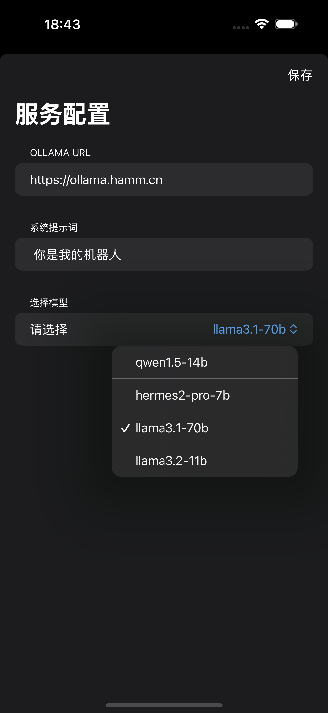
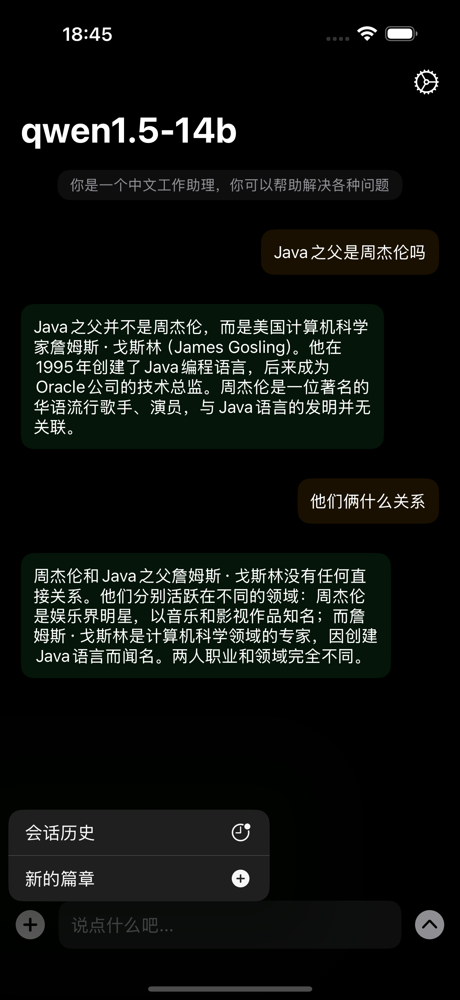
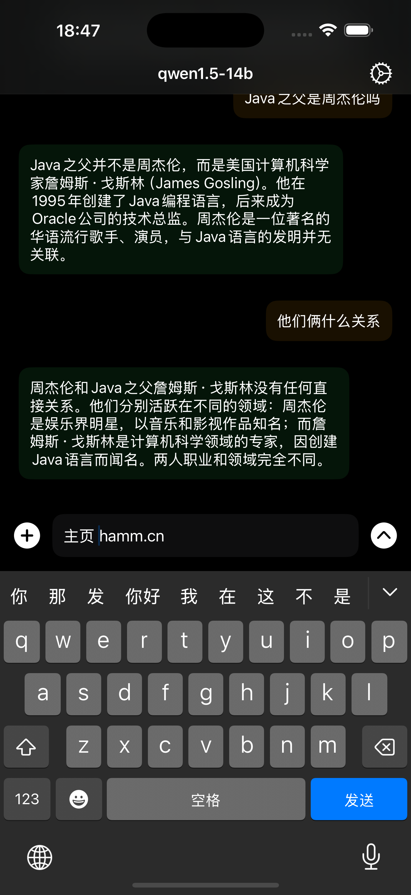

# Hi, OllamaK!

### 项目说明

这是一个 `Swift + SwiftUI` 实现的 `iOS` 端的 `Ollama` 客户端，可通过配置 `Ollama Server Url` 后调用本地的 `Ollama` 模型进行对话。

当然，你也可以通过在 `Cloudflare Worker` 上部署一个自己的 `Ollama` 服务来配合本项目使用。

### 项目截图

<p>



</p>

### Cloudflare Worker 代码示例

通过模拟 `Ollama` 的数据结构，你可以轻松地实现自己的 `Ollama` 云服务。

> 示例代码如下

```js
const DEFAULT_MODEL = "qwen1.5-14b"
export default {
  /**
   * # 使用的模型
   */
  model: null,

  /**
   * # 模型列表
   */
  models: [
    {
      name: DEFAULT_MODEL,
      path: '@cf/qwen/qwen1.5-14b-chat-awq'
    },
    {
      name: 'hermes2-pro-7b',
      path: '@hf/nousresearch/hermes-2-pro-mistral-7b'
    },
    {
      name: 'llama3.1-70b',
      path: '@cf/meta/llama-3.1-70b-instruct'
    },
    {
      name: 'llama3.2-11b',
      path: '@cf/meta/llama-3.2-11b-vision-instruct'
    },
  ],

  /**
   * # 环境变量
   */
  env: null,

  /**
   * # 获取请求的JSON
   * @param {*} request 
   * @returns 
   */
  async getRequestJson(request) {
    // 获取请求的JSON字符串
    let json = ''
    const reader = request.body.getReader()
    try {
      // eslint-disable-next-line no-constant-condition
      while (true) {
        // eslint-disable-next-line no-await-in-loop
        const { done, value } = await reader.read()
        if (done) break
        json += new TextDecoder().decode(value)
      }
    } finally {
      reader.releaseLock()
    }

    // 解析请求的JSON到对象
    let requestBody = null
    try {
      requestBody = JSON.parse(json || '{}')
    } catch (e) {
      throw new Error("Bad Json");
    }
    console.log("requestBody", requestBody)
    return requestBody;
  },

  /**
   * # 处理请求
   * @param {Request} request 请求对象
   * @param {Object} env 环境变量
   * @returns 响应对象
   */
  async fetch(request, env) {
    this.env = env;
    const pathname = new URL(request.url).pathname
    if (pathname === '/api/generate') {
      // 判断请求方式
      if (request.method === 'GET') {
        return new Response('Post only!')
      }
      const requestBody = await this.getRequestJson(request)
      this.model = this.models.find(item => item.name === (requestBody.model || DEFAULT_MODEL))
      console.log("model", this.model)
      const aiResponse = await this.doPrompt(requestBody)
      return this.response(false, aiResponse, !!requestBody.stream)
    }
    if (pathname === '/api/chat') {
      // 判断请求方式
      if (request.method === 'GET') {
        return new Response('Post only!')
      }
      const requestBody = await this.getRequestJson(request)
      this.model = this.models.find(item => item.name === (requestBody.model || DEFAULT_MODEL))
      console.log("model", this.model)
      const err = this.checkChatRequestBody(requestBody)
      if (err) {
        return this.jsonError(err)
      }
      const aiResponse = await this.doChat(requestBody)
      return this.response(true, aiResponse, !!requestBody.stream)
    }
    if (pathname === "/api/tags") {
      return Response.json({
        models: this.models.map(item => {
          return {
            name: item.name,
            size: 0,
            digest: Math.random(),
            details: {
              format: "gguf",
              family: "llama",
              families: null,
              parameter_size: "",
              quantization_level: ""
            }
          }
        })
      })
    }
    return new Response('Ollama is running')
  },

  /**
   * # 发送数据给模型并返回
   * @param {object} data 
   * @returns 
   */
  async sendToModel(data) {
    try {
      return await this.env.AI.run(this.model.path, data)
    } catch (e) {
      return this.jsonError(e.message, null, 503)
    }
  },

  /**
   * # Prompt方式请求AI
   * @param {Object} requestBody
   * @returns 
   */
  async doPrompt(requestBody) {
    return await this.sendToModel({
      prompt: requestBody.prompt || '哈哈哈哈哈',
      stream: !!requestBody.stream,
    })
  },

  /**
   * # Chat模式请求AI
   * @param {Object} requestBody 
   * @param {string[]} requestBody.messages
   * @param {any} requestBody.stream
   * @returns 
   */
  async doChat(requestBody) {
    return this.sendToModel({
      messages: requestBody.messages,
      stream: !!requestBody.stream,
    })
  },

  /**
   * # 获取跨域请求头
   * @param {boolean} isStream
   * @returns 请求头对象
   */
  getCrossDomainHeaders(isStream = false) {
    const headers = {
      'Access-Control-Allow-Origin': '*',
      'Access-Control-Allow-Methods': '*',
    }
    if (isStream) {
      headers['Content-Type'] = 'text/event-stream;charset=UTF-8'
    } else {
      headers['Content-Type'] = 'application/json;charset=UTF-8'
    }
    return headers
  },

  /**
   * # AI响应
   * @param {boolean} isChat 是否聊天模式 
   * @param {Object} aiResponse 
   * @param {boolean} stream 
   * @returns 
   */
  response(isChat, aiResponse, stream = false) {
    console.log("model", this.model)
    // 直接返回结果
    if (!stream) {
      return Response.json({
        message: isChat ? {
          role: "assistant",
          content: aiResponse.response
        } : undefined,
        response: isChat ? undefined : aiResponse.response,
        model: this.model.name,
        done: true,
        created_at: new Date(),
        done_reason: "stop",
        context: [],
        total_duration: 0,
        load_duration: 0,
        prompt_eval_count: 0,
        prompt_eval_duration: 0,
        eval_count: 0,
        eval_duration: 0
      })
    }
    // 使用Stream方式返回结果
    const processedStream = new TransformStream({
      transform: async (chunk, controller) => {
        // 对 chunk 数据进行处理
        const text = new TextDecoder()
          .decode(chunk)
          .replaceAll('data: {', '{')
          .replaceAll('data: [', '[')
          .replaceAll('\n', '')
        if (text === '[DONE]') {
          controller.enqueue(
            new TextEncoder().encode(
              JSON.stringify({
                created_at: new Date(),
                message: isChat ? {
                  role: "assistant",
                  content: ''
                } : undefined,
                response: isChat ? undefined : '',
                done: true,
                done_reason: "stop",
                model: this.model.name,
                context: [],
                total_duration: 0,
                load_duration: 0,
                prompt_eval_count: 0,
                prompt_eval_duration: 0,
                eval_count: 0,
                eval_duration: 0

              }),
            ),
          )
          return
        }
        const { response } = JSON.parse(text)
        if (response !== '') {
          const content = JSON.stringify({
            done: false,
            message: isChat ? {
              role: "assistant",
              content: response
            } : undefined,
            response: isChat ? undefined : response,
            model: this.model.name,
            created_at: new Date(),
          })
          controller.enqueue(new TextEncoder().encode(content + "\n"))
        }
      },
      flush: (controller) => {
        controller.terminate()
      },
    })
    aiResponse.pipeTo(processedStream.writable)
    return new Response(processedStream.readable, {
      headers: this.getCrossDomainHeaders(true),
    })
  },

  /**
   * # JSON返回
   * @param {string} message 错误信息
   * @param {number} code 错误代码
   * @param {any} data 返回数据
   * @returns JSON对象
   */
  json(message, code = 200, data = null) {
    if (data === null) {
      return Response.json(
        { code, message },
        {
          headers: this.getCrossDomainHeaders(),
        },
      )
    }
    return Response.json(
      {
        code,
        message,
        data,
      },
      {
        headers: this.getCrossDomainHeaders(),
      },
    )
  },

  /**
   * # JSON错误返回
   * @param {string} message 错误信息
   * @param {any} data 返回数据
   * @param {number} code 错误代码
   */
  jsonError(message, data = null, code = 500) {
    // eslint-disable-next-line no-console
    console.error(message, data)
    return this.json(message, code, data)
  },

  /**
   * # JSON数据返回
   * @param {any} data 返回数据
   * @param {string} message 错误信息
   * @param {number} code 错误代码
   */
  jsonData(data, message = 'success', code = 200) {
    return this.json(message, code, data)
  },

  /**
   * # 检查Chat请求对象
   * @param {Object} requestBody 请求对象
   * @param {Array} requestBody.messages
   * @returns 错误信息
   */
  checkChatRequestBody(requestBody) {
    if (!requestBody.messages) {
      return 'No Messages!'
    }
    if (!(requestBody.messages instanceof Array)) {
      return 'Messages must be array'
    }
    // eslint-disable-next-line guard-for-in
    for (const i in requestBody.messages) {
      const item = requestBody.messages[i]
      if (!(typeof item === 'object' && item instanceof Object)) {
        return `The ${i}th message is not object!`
      }
      if (!item.role) {
        return `The ${i}th message 'role' is missing!`
      }
      const roles = ['system', 'user', 'assistant']
      if (!roles.includes(item.role)) {
        return (
          `The ${i}th message 'role' is not in [${roles.join(',')}]!`
        )
      }
      if (
        item.content === null
        || item.content === undefined
      ) {
        return `The ${i}th message 'content' cannot be empty!`
      }
    }
    return null
  },
}

```